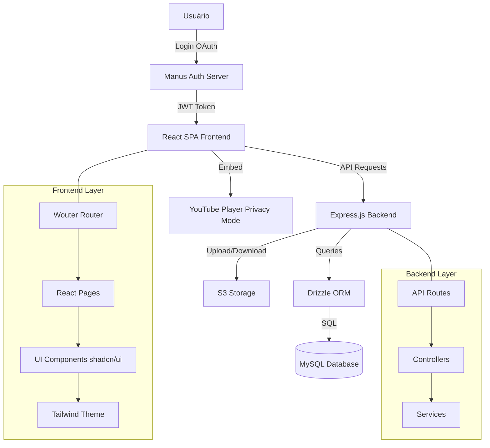

# Arquitetura da Solução - Prospera Academy

Este documento descreve a arquitetura técnica, decisões de design e fluxo de dados da plataforma web **Prospera Academy**.

## 🏗️ Visão Geral

A Prospera Academy é uma **aplicação Full-Stack** moderna, construída com React 19, Express.js, MySQL e Drizzle ORM. A plataforma gerencia cursos, tracking de progresso, anotações pessoais, avaliações e autenticação de usuários.

### Diagrama de Arquitetura



## 🧩 Stack Tecnológica

### Frontend
- **React 19**: Framework UI com Hooks e Concurrent Features.
- **Vite 7**: Build tool ultra-rápido com HMR.
- **Tailwind CSS 4**: Utility-first CSS framework.
- **shadcn/ui**: Componentes acessíveis e customizáveis.
- **Wouter**: Roteamento leve (< 2KB).
- **ReactPlayer**: Player de vídeo white-label.

### Backend
- **Express.js**: Servidor HTTP para APIs RESTful.
- **Drizzle ORM**: Type-safe SQL query builder.
- **MySQL**: Banco de dados relacional.
- **tRPC** (opcional): Type-safe APIs entre cliente e servidor.

### Infraestrutura
- **S3**: Armazenamento de PDFs, slides e materiais.
- **OAuth 2.0**: Autenticação via Manus (Google, GitHub, Email).
- **JWT**: Tokens de sessão HTTP-only.

## 🗄️ Modelo de Dados (Database Schema)

### Tabelas Principais

#### `users`
Armazena informações de usuários autenticados.
- `id` (PK): ID auto-incrementado.
- `openId`: Identificador OAuth único.
- `name`, `email`, `loginMethod`: Dados do perfil.
- `role`: `user` ou `admin`.
- `createdAt`, `updatedAt`, `lastSignedIn`: Timestamps.

#### `courses`
Metadados dos cursos.
- `id` (PK): ID auto-incrementado.
- `courseId` (UNIQUE): Slug do curso (ex: `gestao-fazendas-gado-leite`).
- `acronym`: Sigla (ex: `GFGL`).
- `title`, `description`, `thumbnail`: Informações do curso.
- `totalVideos`: Número total de aulas.

#### `lessons`
Aulas individuais.
- `id` (PK): ID auto-incrementado.
- `lessonId` (UNIQUE): Identificador da aula (ex: `lesson-01-01-01`).
- `courseId` (FK): Relacionamento com `courses`.
- `moduleId`, `moduleName`, `sectionId`, `sectionName`: Hierarquia.
- `title`, `youtubeUrl`, `type`, `order`: Metadados da aula.

#### `user_progress`
Tracking de progresso por usuário.
- `userId` (FK): Relacionamento com `users`.
- `lessonId` (FK): Relacionamento com `lessons`.
- `courseId` (FK): Relacionamento com `courses`.
- `completed`: Booleano indicando conclusão.
- `lastWatchedPosition`: Posição em segundos (para retomar).
- **Constraint**: UNIQUE(`userId`, `lessonId`) para evitar duplicatas.

#### `user_notes`
Anotações pessoais em timestamps específicos.
- `userId` (FK): Relacionamento com `users`.
- `lessonId` (FK): Relacionamento com `lessons`.
- `timestamp`: Posição no vídeo (em segundos).
- `content`: Texto da anotação.

#### `ratings`
Avaliações de aulas e cursos.
- `userId` (FK): Relacionamento com `users`.
- `targetType`: `lesson` ou `course`.
- `targetId`: ID da aula ou curso.
- `ratingType`: `like`, `dislike` ou `stars`.
- `stars`: 1-5 (nullable se tipo for like/dislike).
- **Constraint**: UNIQUE(`userId`, `targetType`, `targetId`).

#### `course_materials`
Materiais complementares (PDFs, slides).
- `courseId` (FK): Relacionamento com `courses`.
- `lessonId` (FK, opcional): Relacionamento com `lessons`.
- `title`, `description`, `type`: Metadados do arquivo.
- `fileUrl`, `fileKey`: URLs e chaves S3.
- `fileSize`, `mimeType`: Informações do arquivo.

#### `video_transcripts`
Transcrições e sumários para IA.
- `lessonId` (FK, UNIQUE): Relacionamento com `lessons`.
- `transcript`: Texto completo da transcrição.
- `summary`: Sumário gerado por IA.
- `keywords`: Palavras-chave para busca.

## 🔄 Fluxo de Dados

### 1. Autenticação
```
Usuário clica em "Login"
  ↓
Redirecionado para Manus OAuth Server
  ↓
Usuário autentica (Google/GitHub/Email)
  ↓
Callback retorna com código OAuth
  ↓
Backend troca código por JWT
  ↓
JWT armazenado em cookie HTTP-only
  ↓
Frontend recebe estado de autenticação via hook useAuth()
```

### 2. Navegação e Progresso
```
Usuário seleciona curso
  ↓
GET /api/courses/:id → Retorna metadados do DB
  ↓
Usuário clica em aula
  ↓
GET /api/lessons/:id → Retorna dados da aula
  ↓
Player carrega vídeo do YouTube
  ↓
A cada 10 segundos: POST /api/progress → Salva posição no DB
  ↓
Ao finalizar: PUT /api/progress → Marca como completa
```

### 3. Anotações
```
Usuário pausa vídeo em 02:35
  ↓
Clica em "Adicionar Nota"
  ↓
POST /api/notes → Salva { lessonId, timestamp: 155, content: "..." }
  ↓
Nota aparece na sidebar da aula
  ↓
Clique na nota → Salta para timestamp no vídeo
```

### 4. Avaliações
```
Usuário clica em "👍" ou "⭐⭐⭐⭐⭐"
  ↓
POST /api/ratings → Salva { targetType: "lesson", targetId, ratingType, stars }
  ↓
Backend atualiza estatísticas agregadas
  ↓
UI exibe média de estrelas do curso
```

## 🔐 Segurança

### Autenticação e Autorização
- **OAuth 2.0**: Login seguro via provedores confiáveis.
- **JWT**: Tokens assinados para validação de sessão.
- **Roles**: Controle de acesso baseado em funções (`user`/`admin`).

### Proteção de Conteúdo
- **Vídeos Unlisted**: URLs do YouTube não são indexadas.
- **Player White-Label**: Oculta logo e links diretos.
- **Limitação**: YouTube ainda permite acesso direto via URL (ver `VIDEO_PRIVACY_GUIDE.md`).

### Validação de Dados
- **Backend**: Validação com Zod antes de salvar no DB.
- **Frontend**: Validação de formulários com React Hook Form + Zod.

### Armazenamento Seguro
- **S3**: Arquivos privados com URLs assinadas (presigned URLs).
- **Env Vars**: Credenciais em variáveis de ambiente, nunca no código.

## 🚀 Escalabilidade e Evolução

### Próximas Funcionalidades
- **Admin Panel**: Interface para adicionar/editar cursos.
- **Certificados**: Geração automática de PDFs de conclusão.
- **Busca Global**: Elasticsearch ou Algolia para busca de aulas.
- **Transcrições IA**: Geração automática de sumários com GPT-4.
- **Modo Offline**: PWA com cache de vídeos.

### Migração para Microserviços (Futuro)
- **Serviço de Vídeo**: Processamento de uploads e transcrições.
- **Serviço de Certificados**: Geração de PDFs em background.
- **Serviço de Notificações**: Email/push para novos cursos.

### Performance
- **CDN**: Cloudflare para assets estáticos.
- **Cache**: Redis para sessões e queries frequentes.
- **Lazy Loading**: Carregar módulos sob demanda.

### Monitoramento
- **Logs**: Winston ou Pino para logs estruturados.
- **Métricas**: Prometheus + Grafana para dashboards.
- **Erros**: Sentry para tracking de exceções.

## 📊 Decisões Arquiteturais

### Por que Full-Stack?

**Requisitos que exigem backend:**
- **Tracking de progresso**: Sincronizar entre múltiplos dispositivos.
- **Anotações pessoais**: Armazenar notas privadas por usuário.
- **Avaliações**: Coletar feedback e estatísticas.
- **Administração**: Gerenciar cursos, usuários e materiais.
- **Segurança**: Controlar acesso a cursos licenciados.

### Por que MySQL + Drizzle ORM?

- **Relacional**: Estrutura hierárquica de cursos/módulos/aulas se beneficia de JOINs.
- **Type-Safe**: Drizzle gera tipos TypeScript automaticamente.
- **Performance**: Queries otimizadas com índices e constraints.
- **Migração**: Sistema de migrations versionado (Drizzle Kit).

### Por que Wouter?

- **Tamanho**: < 2KB vs 12KB do React Router.
- **Hooks**: API moderna e simples.
- **SSR-Ready**: Funciona com Express sem configuração extra.

### Por que ReactPlayer?

- **Abstração**: Suporta YouTube, Vimeo, Twitch, etc.
- **Customização**: Controle total sobre player UI.
- **Privacidade**: Configurações para ocultar branding.

## 📚 Referências

- [Drizzle ORM Docs](https://orm.drizzle.team/)
- [React 19 Docs](https://react.dev/)
- [Tailwind CSS 4 Docs](https://tailwindcss.com/)
- [Wouter GitHub](https://github.com/molefrog/wouter)
- [ReactPlayer GitHub](https://github.com/cookpete/react-player)
