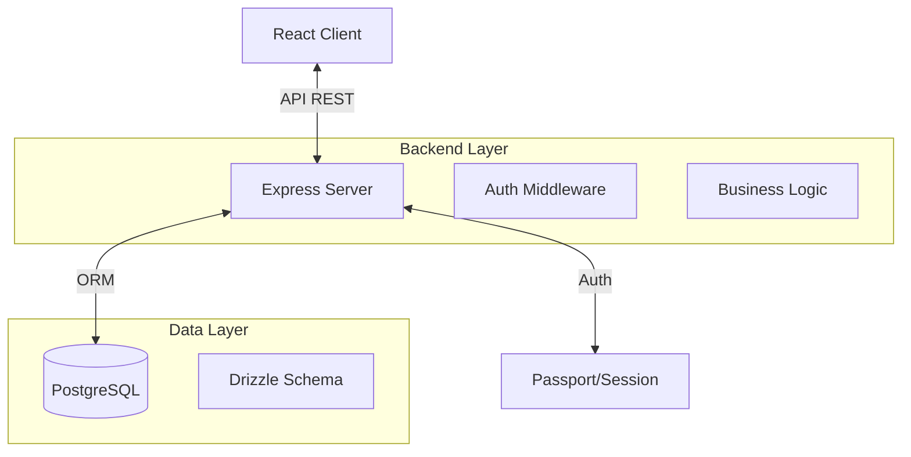

# Transição para Arquitetura Full-Stack

Este documento detalha a evolução da arquitetura da **Prospera Academy** de uma aplicação estática (SPA) para uma solução Full-Stack robusta, necessária para suportar as novas funcionalidades de negócio.

## 🎯 Motivação da Mudança

A arquitetura inicial (Static SPA) foi excelente para uma prova de conceito rápida e de baixo custo. No entanto, os novos requisitos de negócio exigem persistência de dados por usuário e lógica de servidor segura, o que é inviável em um ambiente puramente estático.

### Novos Requisitos vs. Limitações Atuais

| Requisito | Limitação da Arquitetura Estática | Solução Full-Stack |
|-----------|-----------------------------------|--------------------|
| **Login de Usuário** | Não suporta sessões seguras ou proteção de rotas no servidor. | Autenticação via Passport.js / Sessões HTTP-only. |
| **Progresso (Tracking)** | Só permite salvar no navegador (localStorage), perdendo dados ao trocar de dispositivo. | Banco de dados relacional (PostgreSQL) para persistência centralizada. |
| **Anotações Pessoais** | Impossível salvar dados privados de forma segura sem backend. | Tabela `notes` vinculada ao `user_id`. |
| **Avaliações (Rating)** | Não há onde armazenar votos agregados. | Tabela `ratings` com funções de agregação SQL. |
| **Administração** | Não é possível proteger rotas de admin ou gerenciar conteúdo dinamicamente. | Role-based Access Control (RBAC) e API protegida. |

## 🏗️ Nova Arquitetura Proposta

A aplicação evoluirá para um modelo **Monólito Modular** utilizando a stack PERN (Postgres, Express, React, Node.js), mantendo a simplicidade de deploy mas ganhando poder de processamento.

### Diagrama de Componentes

### Tecnologias Adicionais

1. **Banco de Dados**: **PostgreSQL** (via Neon ou local)
   - Robusto, relacional e ideal para dados estruturados (usuários, cursos, progresso).
2. **ORM**: **Drizzle ORM**
   - Leve, type-safe e com excelente performance. Facilita migrações e queries.
3. **Autenticação**: **Passport.js + Express Session**
   - Gerenciamento de sessões seguro e padrão de mercado.
4. **API**: **Express.js**
   - Servidor Node.js para expor endpoints RESTful (`/api/courses`, `/api/progress`).

## 🔄 Plano de Migração de Dados

1. **Cursos**: O arquivo `courses-data.json` atual servirá como "seed" (semente) para popular o banco de dados inicial.
2. **Usuários**: Criação de sistema de registro/login.
3. **Progresso**: Migração da lógica de `localStorage` (se houver) para chamadas de API `POST /api/progress`.

## 🛡️ Segurança

- **Senhas**: Hashing com `scrypt` ou `argon2`.
- **Sessões**: Cookies `HttpOnly` e `Secure` para prevenir XSS.
- **API**: Validação de dados com `Zod` em todas as rotas.

Esta transição prepara a Prospera Academy para escalar de um visualizador de vídeos para uma verdadeira plataforma de ensino corporativo.
